<div align="center">

# 🎓 AI Academic Assignment Generator

### *Intelligent Document Analysis & Professional Assignment Creation*

[](https://www.python.org/downloads/)
[](https://opensource.org/licenses/MIT)
[](https://streamlit.io)
[](https://openrouter.ai)

**Transform PDF documents into professionally formatted assignments with AI-powered analysis**

[🚀 Getting Started](#-quick-start) • [✨ Features](#-features) • [📖 Documentation](#-usage-guide) • [🤝 Connect](#-connect-with-me)

---

</div>

## 🌟 Overview

The **AI Academic Assignment Generator** is a powerful tool that combines document analysis with professional formatting to help students and academics create high-quality assignments. Upload your PDF materials, and let AI handle the analysis and formatting while you focus on the content.

### 🎯 What Makes This Special?

- 🧠 **Intelligent Analysis** - Deep understanding of academic documents
- 📄 **Dual Format Export** - Generate both PDF and ODT files
- 🎨 **Professional Formatting** - Academic-standard layouts and styling
- ⚡ **Fast & Efficient** - Powered by OpenRouter's advanced AI models
- 🆓 **Open Source** - Free to use and modify

---

## ✨ Features

<table>
<tr>
<td width="50%">

### 📚 Document Processing
- ✅ PDF text extraction
- ✅ Intelligent content analysis
- ✅ Key topic identification
- ✅ Ambiguity detection
- ✅ Instruction extraction

</td>
<td width="50%">

### 📝 Assignment Generation
- ✅ Professional cover pages
- ✅ Customizable student details
- ✅ Academic formatting
- ✅ Proper heading hierarchy
- ✅ Citation-ready structure

</td>
</tr>
<tr>
<td width="50%">

### 📤 Export Formats
- 📄 **PDF** - Perfect for submission
- 📝 **ODT** - Ideal for editing
- 🖼️ Logo support (PDF)
- 📐 Custom page layouts
- 🎨 Professional styling

</td>
<td width="50%">

### 💻 User Interface
- 🌐 Interactive web app
- 📱 Responsive design
- 🔄 Real-time processing
- 💾 Instant downloads
- 🎯 Intuitive workflow

</td>
</tr>
</table>

---

## 📊 Format Comparison

| Feature | PDF Format | ODT Format |
|:--------|:----------:|:----------:|
| **Fixed Layout** | ✅ | ❌ |
| **Fully Editable** | ⚠️ Limited | ✅ |
| **Print Quality** | ⭐⭐⭐⭐⭐ | ⭐⭐⭐⭐ |
| **Collaboration** | ⚠️ Limited | ✅ |
| **Logo Support** | ✅ | 🔜 Coming Soon |
| **File Size** | Larger | Smaller |
| **Universal Compatibility** | ✅ | ⚠️ Word Processors |
| **Best For** | Submission | Editing & Review |

---

## 🚀 Quick Start

### Prerequisites

```bash
Python 3.8 or higher
OpenRouter API key (free tier available)
```

### Installation

1️⃣ **Clone the repository**
```bash
git clone https://github.com/musagithub1/Assignment-Generator-AI-Agent.git
cd Assignment-Generator-AI-Agent
```

2️⃣ **Install dependencies**
```bash
pip install -r requirements.txt
```

3️⃣ **Configure API key**

Create a `.env` file in the project root:
```env
OPENROUTER_API_KEY=your-api-key-here
```

Or set it as an environment variable:
```bash
export OPENROUTER_API_KEY="your-api-key-here"
```

4️⃣ **Launch the application**
```bash
streamlit run enhanced_streamlit_app.py
```

🎉 **That's it!** The app will open in your browser at `http://localhost:8501`

---

## 📖 Usage Guide

### Using the Web Interface

```mermaid
graph LR
    A[📤 Upload PDF] --> B[📝 Add Instructions]
    B --> C[🔍 AI Analysis]
    C --> D[✏️ Review & Clarify]
    D --> E[🎯 Generate Assignment]
    E --> F[💾 Download PDF/ODT]
    
    style A fill:#e3f2fd
    style C fill:#fff3e0
    style E fill:#e8f5e9
    style F fill:#f3e5f5
```

<div align="center">



</div>

**Step-by-step process:**

1. 📤 **Upload** your PDF document
2. 📝 **Enter** assignment instructions (optional)
3. 🔍 **Review** AI-generated analysis
4. ✏️ **Provide** clarifications if needed
5. 🎯 **Generate** your assignment
6. 💾 **Download** in your preferred format (PDF or ODT)

### Using the Python API

```python
import enhanced_agent as agent

# Step 1: Extract text from PDF
with open('document.pdf', 'rb') as f:
    pdf_data = f.read()
pdf_text = agent.extract_pdf_text(pdf_data)

# Step 2: Run AI analysis
analysis = agent.run_analysis(pdf_text, "Your assignment instructions")
print(analysis)

# Step 3: Generate assignment
assignment = agent.run_assignment(
    pdf_text, 
    "Your instructions", 
    "Optional clarifications"
)

# Step 4: Create ODT file
odt_data = agent.create_assignment_odt(
    name="John Doe",
    registration_number="STD-12345",
    instructor_name="Dr. Jane Smith",
    semester="Fall 2024",
    university_name="University of Technology",
    assignment_text=assignment,
    title="Academic Assignment"
)

# Save the file
with open('assignment.odt', 'wb') as f:
    f.write(odt_data)
```

---

## 🏗️ Project Structure

```
Assignment-Generator-AI-Agent/
│
├── 📄 enhanced_agent.py              # Core AI agent with ODT support
├── 🌐 enhanced_streamlit_app.py      # Web interface
├── 📋 requirements.txt               # Python dependencies
├── 🧪 test_odt_generation.py         # Testing script
├── 📖 README.md                      # This file
│
├── 📁 original_files/                # Original implementation
│   ├── agentz.py
│   ├── streamlit_app.py
│   ├── assignment_template.html
│   └── requirements.txt
│
└── 📁 examples/                      # Sample outputs
    ├── sample_assignment.odt
    └── sample_assignment.pdf
```

---

## ⚙️ Configuration

### AI Models

The system uses **OpenRouter API** with flexible model selection:

**Default Model:** `z-ai/glm-4.5-air:free` (free tier)

**Supported Models:**
- `openai/gpt-3.5-turbo`
- `openai/gpt-4`
- `anthropic/claude-3-sonnet`
- `anthropic/claude-3-opus`
- And 100+ more on OpenRouter

**Custom Model Configuration:**
```python
analysis = agent.run_analysis(
    pdf_text, 
    questions, 
    model_name="anthropic/claude-3-sonnet",
    temperature=0.1
)
```

### Formatting Options

#### ODT Format Features
- 📝 Heading styles (H1, H2, H3)
- 📄 Justified paragraphs
- 📋 Bulleted and numbered lists
- 🎓 Professional cover page
- 🔤 Times New Roman font (academic standard)

#### PDF Format Features
- 🖼️ Custom logo support
- 📏 Proper margins and spacing
- 🔢 Automatic page numbers
- 🎨 Fixed layout formatting
- 📐 Print-ready quality

---

## 🧪 Testing

Verify ODT generation functionality:

```bash
python test_odt_generation.py
```

**Test coverage includes:**
- ✅ ODT file creation
- ✅ Formatting validation
- ✅ Content verification
- ✅ Compatibility testing

---

## 🔧 Troubleshooting

<details>
<summary><b>🚨 Common Issues & Solutions</b></summary>

### ODT Files Won't Open
```
✅ Solution:
1. Ensure .odt extension is present
2. Open with LibreOffice Writer first
3. Check file size (should be > 1KB)
4. Try re-generating the file
```

### Missing Dependencies
```bash
pip install --upgrade -r requirements.txt
```

### API Connection Issues
```
✅ Check:
1. API key is correctly set in .env file
2. OpenRouter account has available credits
3. Internet connection is stable
4. Try a different model if current one fails
```

### Formatting Problems
```
✅ Tips:
1. Use LibreOffice Writer for best ODT compatibility
2. Update to latest version of your word processor
3. Convert to DOCX if needed for Microsoft Word
```

</details>

---

## 🔄 Migration Guide

Upgrading from the original version? Follow these steps:

```bash
# 1. Backup your files
cp agentz.py agentz.py.backup
cp streamlit_app.py streamlit_app.py.backup

# 2. Update to enhanced version
# Use enhanced_agent.py and enhanced_streamlit_app.py

# 3. Install new dependencies
pip install -r requirements.txt

# 4. Test functionality
python test_odt_generation.py

# 5. Run the enhanced app
streamlit run enhanced_streamlit_app.py
```

---

## 🎯 Roadmap

### 🔜 Coming Soon
- [ ] 📄 DOCX format support
- [ ] 🖼️ Logo support in ODT files
- [ ] 🎨 Custom styling templates
- [ ] 📦 Batch processing
- [ ] ☁️ Cloud storage integration
- [ ] 🌍 Multi-language support

### 💡 Future Enhancements
- [ ] 🤖 Advanced AI models integration
- [ ] 📊 Citation management
- [ ] 🔗 Reference linking
- [ ] 📱 Mobile app version
- [ ] 🎓 Subject-specific templates

---

## 🤝 Connect With Me

<div align="center">

### 👨‍💻 Mussa Khan

[](https://www.linkedin.com/in/mussakhan-ai/)
[](https://github.com/musagithub1)
[](mailto:mussakhan.ai@gmail.com)

**🌟 AI Engineer | Machine Learning Enthusiast | Open Source Contributor**

</div>

---

## 📄 License & Usage

<div align="center">

### 🆓 Open Source & Free to Use

**This version is open source and free to use.**

For the latest or enhanced version, contact me directly.

[](https://opensource.org/licenses/MIT)

</div>

---

## 🙏 Acknowledgments

- 🤖 Powered by [OpenRouter API](https://openrouter.ai)
- 🚀 Built with [Streamlit](https://streamlit.io)
- 📄 PDF processing with PyPDF2
- 📝 ODT generation with odfpy

---

## 📞 Support

Need help or have questions?

1. 📚 Check the [Usage Guide](#-usage-guide)
2. 🔍 Review [Troubleshooting](#-troubleshooting)
3. 🧪 Run the test script
4. 💬 [Open an issue](https://github.com/musagithub1/Assignment-Generator-AI-Agent/issues)
5. 📧 Contact me on [LinkedIn](https://www.linkedin.com/in/mussakhan-ai/)

---

<div align="center">

### ⭐ If you find this project helpful, please give it a star!

**Made with ❤️ by [Mussa Khan](https://www.linkedin.com/in/mussakhan-ai/)**

*Empowering students and academics with AI-powered tools*

---

**🎉 Happy Assignment Writing! 🎉**

</div>